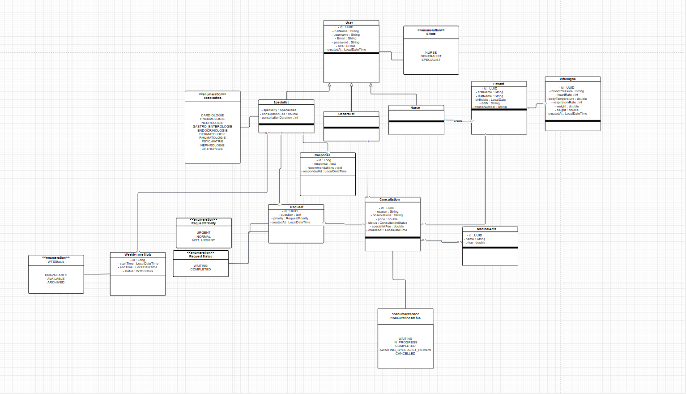

# Projet Télé-Expertise Médicale

Ce projet est un système de télé-expertise médicale conçu pour optimiser le parcours patient et faciliter la coordination entre les médecins généralistes et les spécialistes. L'application permet à un médecin généraliste de solliciter l'avis d'un médecin spécialiste à distance pour un patient donné, améliorant ainsi la collaboration et la qualité des soins.

## Table des Matières

1.  [Fonctionnalités](#fonctionnalités)
2.  [Structure du Projet](#structure-du-projet)
3.  [Technologies Utilisées](#technologies-utilisées)
4.  [Structure de la Base de Données (Scripts SQL)](#structure-de-la-base-de-données-scripts-sql)
5.  [Installation et Configuration](#installation-et-configuration)
6.  [Scénarios d'Utilisation](#scénarios-dutilisation)

---

## Fonctionnalités

Le projet est divisé en plusieurs modules fonctionnels clés :

### Module Infirmier (TICKET-001)

* Enregistrer un nouveau patient avec ses informations personnelles (nom, prénom, date de naissance, etc.).
* Saisir les signes vitaux du patient (température, pression artérielle, etc.).
* Consulter la liste des patients enregistrés pour la journée.
* Voir les statuts des patients en temps réel (ex: EN_ATTENTE, EN_CONSULTATION).

### Module Médecin Généraliste (TICKET-001 & TICKET-002)

* Visualiser le tableau de bord des patients en attente de consultation.
* Créer une nouvelle consultation pour un patient.
* Ajouter des actes techniques (ex: ECG, analyse de sang) à une consultation.
* Calculer automatiquement le coût total d'une consultation (actes inclus).
* **Rechercher des spécialistes** par spécialité et/ou tarif (implémenté avec l'API Stream Java).
* Consulter les créneaux disponibles d'un spécialiste.
* Créer et envoyer une demande de télé-expertise à un spécialiste.
* Voir le détail d'une consultation et de la demande d'expertise associée.

### Module Spécialiste (TICKET-002)

* Configurer son profil professionnel (spécialité, tarif par expertise, etc.).
* Consulter la liste de ses demandes d'expertise en attente ou terminées.
* Filtrer les demandes d'expertise par statut (`EN_ATTENTE`, `TERMINEE`).
* Accéder au détail d'une demande, incluant le dossier patient complet et la question du généraliste.
* Fournir un avis d'expert et des recommandations.
* Visualiser ses statistiques (nombre d'expertises réalisées, revenus générés).

---

## Structure du Projet

L'architecture du projet suit une organisation standard de type Modèle-Vue-Contrôleur (MVC) adaptée pour les applications web Java EE, visible dans votre capture d'écran.

```plaintext
tele_expertise/
├── src/
│   └── main/
│       ├── java/
│       │   ├── com.mysql.cj.jdbc/  (Driver JDBC)
│       │   ├── csrf/
│       │   │   └── CsrfFilter.java (Filtre de sécurité CSRF)
│       │   └── tele_expertise/
│       │       ├── bootstrapper/   (Initialisation de données)
│       │       ├── dao/            # (Data Access Object) Couche d'accès aux données
│       │       ├── dto/            # (Data Transfer Object) Objets de transfert
│       │       ├── entity/         # Entités JPA mappées à la BDD
│       │       ├── enums/          # Énumérations (RoleUtilisateur, Statut, etc.)
│       │       ├── mapper/         # Convertisseurs Entité <-> DTO
│       │       ├── servise/        # (Service) Couche de logique métier
│       │       ├── servlet/        # Contrôleurs Web (Servlets)
│       │       └── util/           # Classes utilitaires
│       │
│       ├── resources/
│       │   └── META-INF/
│       │       ├── beans.xml       # Configuration CDI
│       │       └── persistence.xml # Configuration JPA/Hibernate
│       │
│       └── webapp/
│           ├── generaliste/
│           ├── infirmier/          # Vues JSP pour l'infirmier
│           ├── specialiste/
│           │   └── dashboard-specialiste.jsp
│           ├── WEB-INF/            # Ressources web protégées
│           └── index.jsp           (Page de connexion, etc.)


```

### Technologies Utilisées

* Backend: Java 8+ (avec API Stream), Servlets 4.0

* Accès aux Données: JPA (Hibernate 5.x)

* Injection de Dépendances: CDI (Contexts and Dependency Injection)

* Base de Données: MySQL 8

* Frontend: JSP (JavaServer Pages), JSTL, HTML5, CSS3

* Serveur d'application: Apache Tomcat 9+

* Gestion de Build: Apache Maven


### Structure de la Base de Données (Scripts SQL)

```
-- Création de la base de données (si elle n'existe pas)
CREATE DATABASE IF NOT EXISTS `tele_expertise_db` 
CHARACTER SET utf8mb4 COLLATE utf8mb4_unicode_ci;

USE `tele_expertise_db`;

-- Table des utilisateurs (Infirmiers, Généralistes, Spécialistes)
CREATE TABLE `Utilisateur` (
    `id` INT AUTO_INCREMENT PRIMARY KEY,
    `nom` VARCHAR(100) NOT NULL,
    `prenom` VARCHAR(100) NOT NULL,
    `email` VARCHAR(255) NOT NULL UNIQUE,
    `mot_de_passe` VARCHAR(255) NOT NULL, -- Doit être hashé
    `role` ENUM('INFIRMIER', 'GENERALISTE', 'SPECIALISTE') NOT NULL,
    `specialite` VARCHAR(100) DEFAULT NULL, -- Pour les spécialistes
    `tarif_expertise` DECIMAL(10, 2) DEFAULT NULL -- Pour les spécialistes
);

-- Table des patients
CREATE TABLE `Patient` (
    `id` INT AUTO_INCREMENT PRIMARY KEY,
    `nom` VARCHAR(100) NOT NULL,
    `prenom` VARCHAR(100) NOT NULL,
    `date_naissance` DATE NOT NULL,
    `telephone` VARCHAR(20),
    `infirmier_id` INT, -- ID de l'infirmier qui a enregistré le patient
    `statut` ENUM('EN_ATTENTE', 'EN_CONSULTATION', 'TERMINE') DEFAULT 'EN_ATTENTE',
    `date_enregistrement` TIMESTAMP DEFAULT CURRENT_TIMESTAMP,
    FOREIGN KEY (`infirmier_id`) REFERENCES `Utilisateur`(`id`)
);

-- Table des signes vitaux (liée au patient)
CREATE TABLE `SignesVitaux` (
    `id` INT AUTO_INCREMENT PRIMARY KEY,
    `patient_id` INT NOT NULL,
    `temperature` DECIMAL(4, 1),
    `pression_arterielle` VARCHAR(20), -- ex: "120/80"
    `frequence_cardiaque` INT,
    `date_mesure` TIMESTAMP DEFAULT CURRENT_TIMESTAMP,
    FOREIGN KEY (`patient_id`) REFERENCES `Patient`(`id`)
);

-- Table des consultations (créées par un généraliste)
CREATE TABLE `Consultation` (
    `id` INT AUTO_INCREMENT PRIMARY KEY,
    `patient_id` INT NOT NULL,
    `generaliste_id` INT NOT NULL,
    `date_consultation` TIMESTAMP DEFAULT CURRENT_TIMESTAMP,
    `diagnostic_general` TEXT,
    `cout_total` DECIMAL(10, 2) DEFAULT 0.00,
    FOREIGN KEY (`patient_id`) REFERENCES `Patient`(`id`),
    FOREIGN KEY (`generaliste_id`) REFERENCES `Utilisateur`(`id`)
);

-- Table des actes techniques (liés à une consultation)
CREATE TABLE `ActeTechnique` (
    `id` INT AUTO_INCREMENT PRIMARY KEY,
    `consultation_id` INT NOT NULL,
    `description` VARCHAR(255) NOT NULL,
    `cout` DECIMAL(10, 2) NOT NULL,
    FOREIGN KEY (`consultation_id`) REFERENCES `Consultation`(`id`)
);

-- Table des demandes de télé-expertise
CREATE TABLE `DemandeExpertise` (
    `id` INT AUTO_INCREMENT PRIMARY KEY,
    `consultation_id` INT NOT NULL,
    `generaliste_id` INT NOT NULL,
    `specialiste_id` INT NOT NULL,
    `question_generaliste` TEXT NOT NULL,
    `statut` ENUM('EN_ATTENTE', 'TERMINEE') DEFAULT 'EN_ATTENTE',
    `date_demande` TIMESTAMP DEFAULT CURRENT_TIMESTAMP,
    FOREIGN KEY (`consultation_id`) REFERENCES `Consultation`(`id`),
    FOREIGN KEY (`generaliste_id`) REFERENCES `Utilisateur`(`id`),
    FOREIGN KEY (`specialiste_id`) REFERENCES `Utilisateur`(`id`)
);

-- Table des avis d'experts (réponse à une demande)
CREATE TABLE `AvisExpert` (
    `id` INT AUTO_INCREMENT PRIMARY KEY,
    `demande_id` INT NOT NULL UNIQUE, -- Un seul avis par demande
    `recommandations` TEXT NOT NULL,
    `date_avis` TIMESTAMP DEFAULT CURRENT_TIMESTAMP,
    FOREIGN KEY (`demande_id`) REFERENCES `DemandeExpertise`(`id`)
);

-- Insertion de quelques données de test (optionnel)
INSERT INTO `Utilisateur` (`nom`, `prenom`, `email`, `mot_de_passe`, `role`) 
VALUES 
('Dupont', 'Jean', 'infirmier@clinique.com', 'hash_pass', 'INFIRMIER'),
('Martin', 'Paul', 'generaliste@clinique.com', 'hash_pass', 'GENERALISTE'),
('Durand', 'Sophie', 'cardio@clinique.com', 'hash_pass', 'SPECIALISTE');

UPDATE `Utilisateur` 
SET `specialite` = 'Cardiologie', `tarif_expertise` = 80.00 
WHERE `email` = 'cardio@clinique.com';

```

## Installation et Configuration

### Prérequis

* JDK 8 (ou 11+)

* Apache Maven 3.6+

* Serveur MySQL 8

* Apache Tomcat 9+

### Étapes d'installation

* Cloner le dépôt

```
git clone [URL_DU_DEPOT]
cd tele_expertise
```
## Compiler le Projet (Maven)

```
mvn clean install
```

### Diagramme Classe

